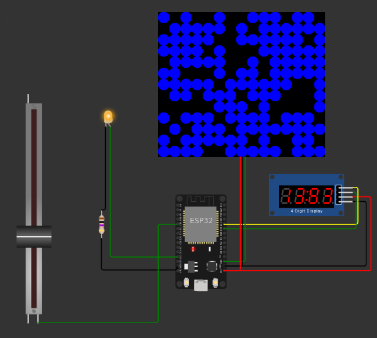
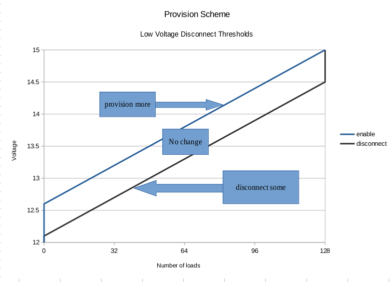

This is a rough sketch of a circuit and scheme to provision an led array for a varying voltage input.

[Try it out on Wokwi](https://wokwi.com/projects/361196616225053697)

The microcontroller (ESP32) uses a simple read from an analog pin to estimate the current voltage. The potentiometer reading is mapped from 0-3.3V to 12-21V to simulate a higher voltage circuit. 

The simulation doesn't factor in voltage drops from additional loads; in real life, provisioning more load would result in a slight voltage drop.  Additionally, slight variability in the load may cause the need for load to be constantly toggled. 

To address this, a simple low voltage disconnect scheme was applied to provision loads, at random, but only when the voltage changed significancy outside of the provided range.

***

With a simulated voltage drop of 0.01 volt per micro-load, the control loop needed several iterations to account for large adjustments in voltage. 

In addition, this sketch used an infinite loop to poll voltage every second. In reality, a voltage monitor on an interrupt for both up and down would be necessary to handle rapid changes in input.
